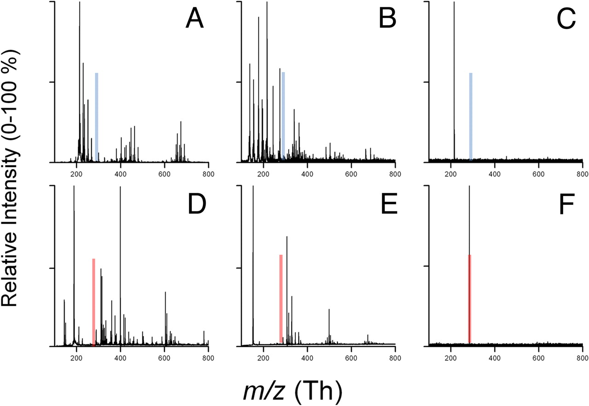

#clustspec
The goal of this project is to make it easier for researchers to do clustering and feature selection on longitudinal mass spectra.  The approch uses principal component analysis for dimensionality and noise reduction, k-means for clustering, and randomized forests for feature selection.

The input for the algorithm should be a matrix of frequencies, where each row represents an individual, and each column represents an integer valued mass to charge ratio on a specific day.  I recommend filling missing values with 0 or a low baseline frequency determined by the precision of your mass spectrometer.
